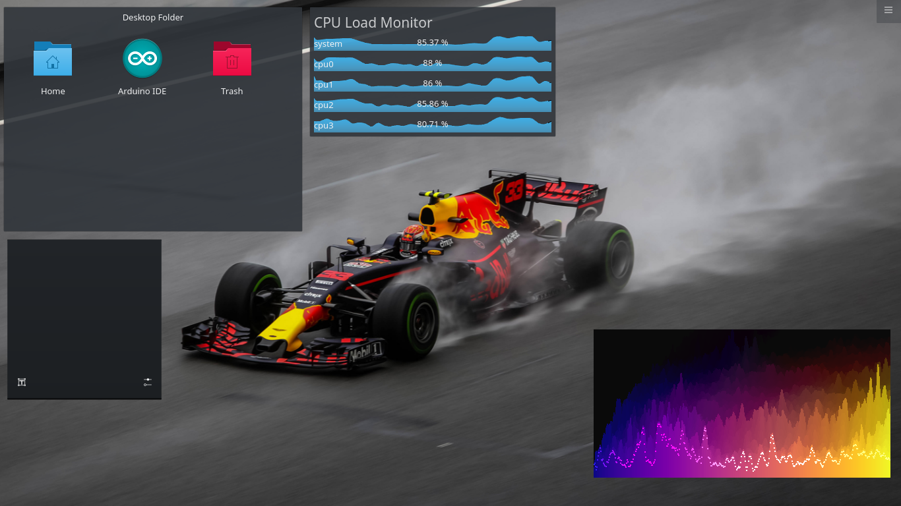

# Audio_Spectrum_Visualizer_KDE_Widget
An audio spectrum visualizer desktop widget for the Kubuntu Desktop Environment

## References
All the heavy lifting has been done by the code in this [GitHub repository](https://github.com/tr1pzz/Realtime_PyAudio_FFT).
</br>
I have just tweaked a few things to make it work like a desktop widget on system startup :grimacing:

## How it looks


## Features
1. The audio spectrum visualizer acts as a desktop widget on system startup and is placed at the bottom right corner of the desktop by default.
2. The widget can be moved to any other position on the desktop by dragging it there.

## Install required packages
```shell
$ pip3 install -r requirements.txt
```

## Configuring for launch on system startup (Kubuntu i.e. KDE Plasma specific)

### Method 1
1. From the Application Menu, search for autostart and open it.
1. Select the Add Script option.
1. Either enter the path for the ``audio_spectrum_desktop_widget.sh`` file after you have done a git clone of the repository locally (or downloaded the zip and unzipped it), or select the location of this file using the file selection popup.
1. Keep the Create as symlink option selected.
1. Click OK and then OK again to save the configuration.

### Method 2 (If method 1 doesn't work)
1. After you have done a git clone of the repository locally (or downloaded the zip and unzipped it), copy the ``audio_spectrum_desktop_widget.desktop`` file to the path ``~/.config/autostart/``.
1. You can launch autostart (as mentioned in method 1) to see the updated configuration.

## Skipping the taskbar and switcher for the widget window (Kubuntu i.e. KDE Plasma specific)
1. From the Application Menu, under Settings, select System Settings.
1. In the System Settings, select Window Management.
1. In Window Management, go to Window Rules.
1. In Window Rules, select New.
1. In the Window matching tab, set the Description as Audio_Spectrum_Visualizer.
1. Keep the 0s delay for Detect Window Properties as it is.
1. For Window class (application), select Substring Match, and enter **py**.
1. For Window role, select Unimportant.
1. In Window types, just select Normal Window.
1. For Window title, select Substring Match, and enter **pygame**.
1. For Machine (hostname), select Unimportant.
1. In the Arrangement and Access tab, select Skip taskbar, then select Force, and finally, select Yes.
1. Do the same for Skip switcher.
1. Select OK, and then select Apply.

Now all you got to do is restart your system and the audio spectrum visualizer desktop widget will be up and running! :sunglasses:
